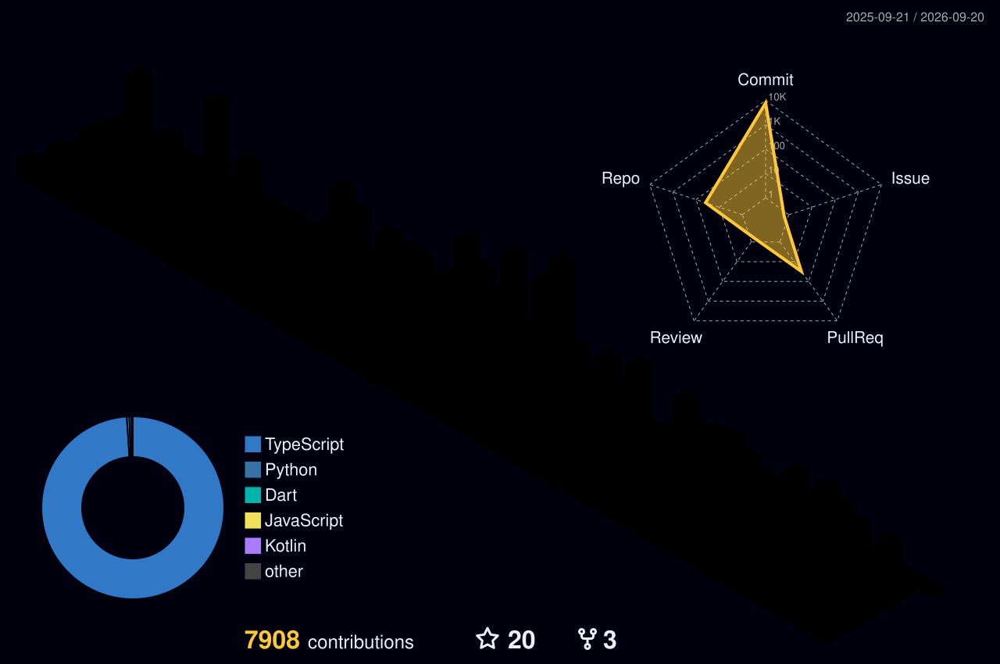

<!-- Header -->

<!-- Typing introduction -->

  

<!-- Social links -->

  
  
  

 

<!-- About -->

## 🚀 About Me

I'm a full-stack engineer who works across **product design, backend architecture, frontend implementation, deployment, and production operations**.

My strongest work begins where requirements are incomplete and operational processes are still manual. I map the real workflow, define the domain model, build the system, and improve it using feedback from production.

- 🔧 I build transactional systems, admin tools, and operational workflows.
- 🧩 I specialize in payments, permissions, data modeling, and legacy modernization.
- 📦 I care about the entire path from an idea to a system people can actually operate.
- 🇰🇷 Based in Korea.

 

<!-- Impact summary -->
## ⚡ Impact at a Glance

  
  
  
  

 

<!-- Projects -->
## 🧭 Selected Work

### 🍊 To Orange — Letter Delivery Platform

> A production platform connecting online letter creation with physical printing, inspection, packaging, and dispatch operations.

  
  
  

- Built core workflows covering **orders, payments, idempotent refunds, points, coupons, referrals, and recipient management**.
- Developed **OTP authentication, OCR-assisted processing, AI writing features, SMS notifications, and retry handling**.
- Built administrative tools for **printing queues, PDFs, envelopes, reports, customer support, and dispatch processing**.
- Designed a **four-level RBAC model** for headquarters, local managers, and operators, with automatic work logs for dispatch, scanning, and inspection.
- Improved the software using direct experience from fulfillment and customer-support operations.

`TypeScript` `Next.js` `Supabase` `PostgreSQL` `Vercel`

---

### 🏝️ Ulleung Sketch — Travel Reservation Platform

> A reservation platform for Ulleungdo packages, ferries, Dokdo tours, accommodations, and vehicle shipment.

  
  
  
  

- Developed separate customer-facing and administrative applications for a multi-domain reservation workflow.
- Worked with **10,000+ existing records** while reviewing a JSONB-heavy schema for long-term extensibility.
- Designed a normalization strategy separating **travelers, rooms, vehicles, schedules, payments, and audit history** from the reservation core.
- Structured the web and admin projects for gradual migration while preserving their existing Git histories.

`TypeScript` `Next.js` `NestJS` `Drizzle ORM` `Supabase` `PostgreSQL` `MUI` `Turborepo`

---

### 🔐 Supabase Security & Backend Architecture Review

> A security and architecture assessment for a client-side Supabase application moving toward a dedicated backend boundary.

  
  
  
  

- Reviewed **27 tables, 4 views, 15 RPCs, 5 triggers, and 35 RLS policies**.
- Traced **302 direct database calls across 43 frontend files**, including 136 write operations.
- Analyzed **1,040 lines of PL/pgSQL** to identify authorization and data-boundary risks.
- Proposed a phased migration that moved writes behind server functions first while temporarily retaining RLS-protected reads.

`PostgreSQL` `Supabase RLS` `Authorization` `API Boundaries` `Migration Strategy`

<!-- Skills -->
## 🛠️ Core Stack

<h3 align="center">Frontend</h3>

  

<h3 align="center">Backend & Data</h3>

  

<h3 align="center">Tools & Delivery</h3>

  

<!-- Stats -->
## 📊 GitHub Activity

  
  

  

  

<!-- Contribution visuals -->
## 🐍 Contributions

  <picture>
    <source media="(prefers-color-scheme: dark)" srcset="https://raw.githubusercontent.com/LeeJaeBae/LeeJaeBae/output/github-contribution-grid-snake-dark.svg" />
    <source media="(prefers-color-scheme: light)" srcset="https://raw.githubusercontent.com/LeeJaeBae/LeeJaeBae/output/github-contribution-grid-snake.svg" />
    
  </picture>

  

<!-- Footer -->

  <strong>Building software that survives contact with the real world.</strong>

